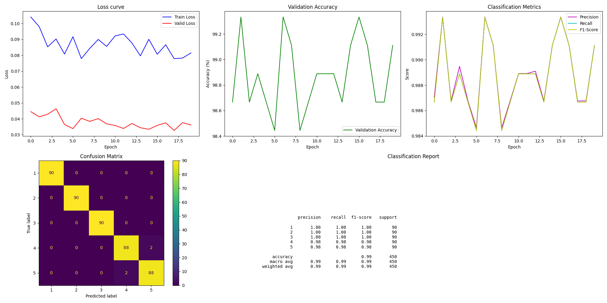
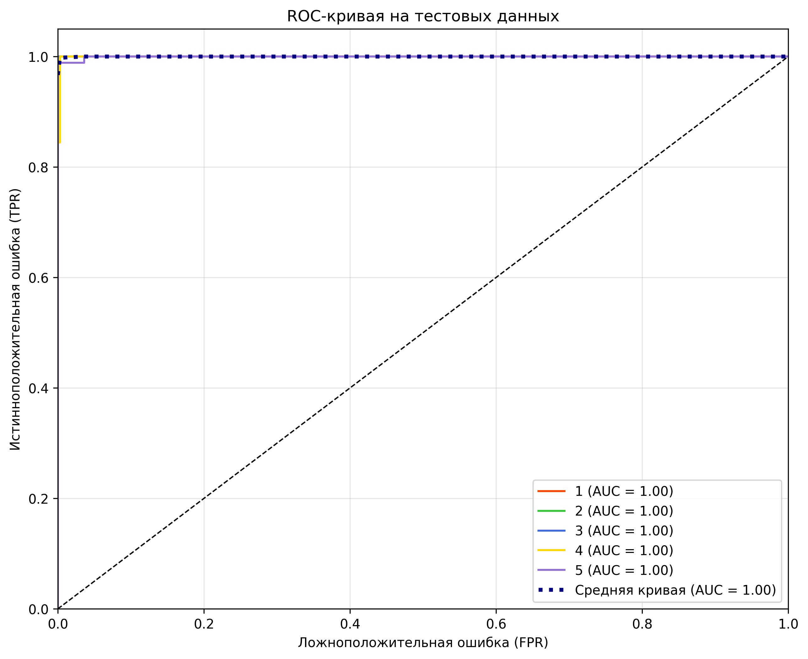

# Отчет о выполнении задания 1

## 1. Исследование архитектур

| Архитектура |                                                                                       Преимущества                                                                                        |                                           Недостатки                                            |                       Источник                       |
|:-----------:|:-----------------------------------------------------------------------------------------------------------------------------------------------------------------------------------------:|:-----------------------------------------------------------------------------------------------:|:----------------------------------------------------:| 
|   EfficientNet   |         Максимальная эффективность благодаря составному масштабированию, подходит для высокого разрешения, автоматически подбирает глубину, ширину и разрешение (как конструктор)         |                 Требует больше ресурсов для обучения (минимум 8 ГБ видеопамяти)                 |         https://habr.com/ru/articles/498168/         | 
|   ResNet-50   |                        Стабильно работает даже на устаревших ПК. «Прыгающие связи» решают проблему «забывчивости» нейросети. Часто берут для первых экспериментов                         |                 На маленьких датасетах (менее 10 тыс. фото) может переобучаться                 | https://top-technologies.ru/ru/article/view?id=37190 | 
|   MobileNetV3	   | Легкая модель. Заточена под смартфоны и дроны: работает даже на процессорах с 1 ГБ памяти. Экономит заряд батареи (в 3 раза быстрее ResNet). Идеальна для приложений типа «камера-шопинг» | Ниже точность на сложных данных. Не подходит для научных задач (анализ рентгена, микроскопия).	 | https://top-technologies.ru/ru/article/view?id=37190 | 

## 2. Подготовка данных
- импорт датасета с `kaggle`
- разделение на выборки - 70/15/15 % *(тренировка/валидация/тест)*

## 3. Модель
В качестве модели была выбрана EfficientNet B4 с предобученными весами. 
Для экономии ресурсов ноутбука указан размер батча 8

После первого этапа доообучения модель была сохранена с точностью 87.11% на 7-й эпохе.
После второго этапа дообучения модель была сохранена с точностью 93.11% на 12-й эпохе.
Дальше код переделывался несколько раз в процессе обучения модели, значения были утеряны вплоть до финального запуска цикла.

В связи с недостаточной вычислительной мощностью ноутбука, на котором изначально разрабатывался проект, последующих этапов дообучения не было предусмотрено.

### upd.
**Модель была переобучена на RTX 2080 SUPER, батч увеличен до 16**

## 4. Результаты обучения

Итоговый  поэтому точное значение сохранилось только у первых двух попыток.

| № цикла обучения | Количество эпох | Размер батча | Точность  |
|:----------------:|:---------------:|:------------:|:---------:| 
|    1 *(cpu)*     |        7        |      8       | `87.11%`  | 
|    2 *(cpu)*     |       12        |      8       | `93.11%`  | 
|    3 *(cpu)*	    |       16        |      8	      |  `~94%`   |
|     #######	     |       #######       |     #######	      |  #######   | 
|   4 *(cuda)*	    |       20        |     16	      |  `~98%`   | 
|    5 *(cuda)*    |       30        |     16	      | `~99.xx%` | 
|    6 *(cuda)*    |       15        |     16	      | `~99.xx%` | 
|    7 *(cuda)*    |       20        |     16	      | `99.56%`  | 

Итоговой точностью модели является значение 99.56%

Метрики цикла 7

ROC цикл 7 на тестовой подборке ~~(сомневаюсь в правильности)~~
