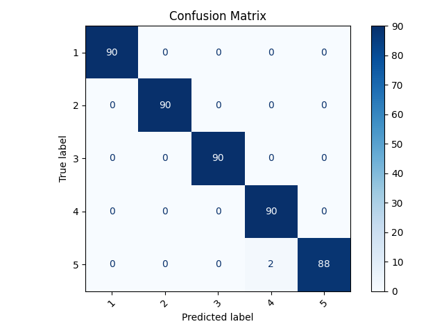
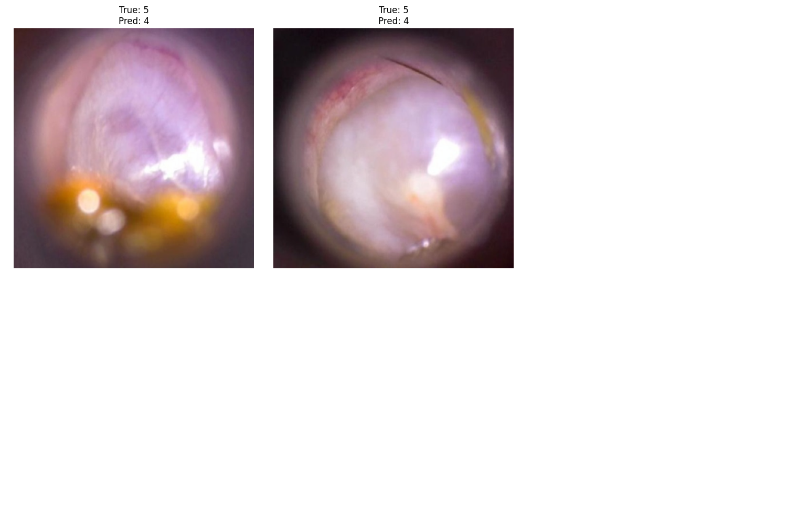
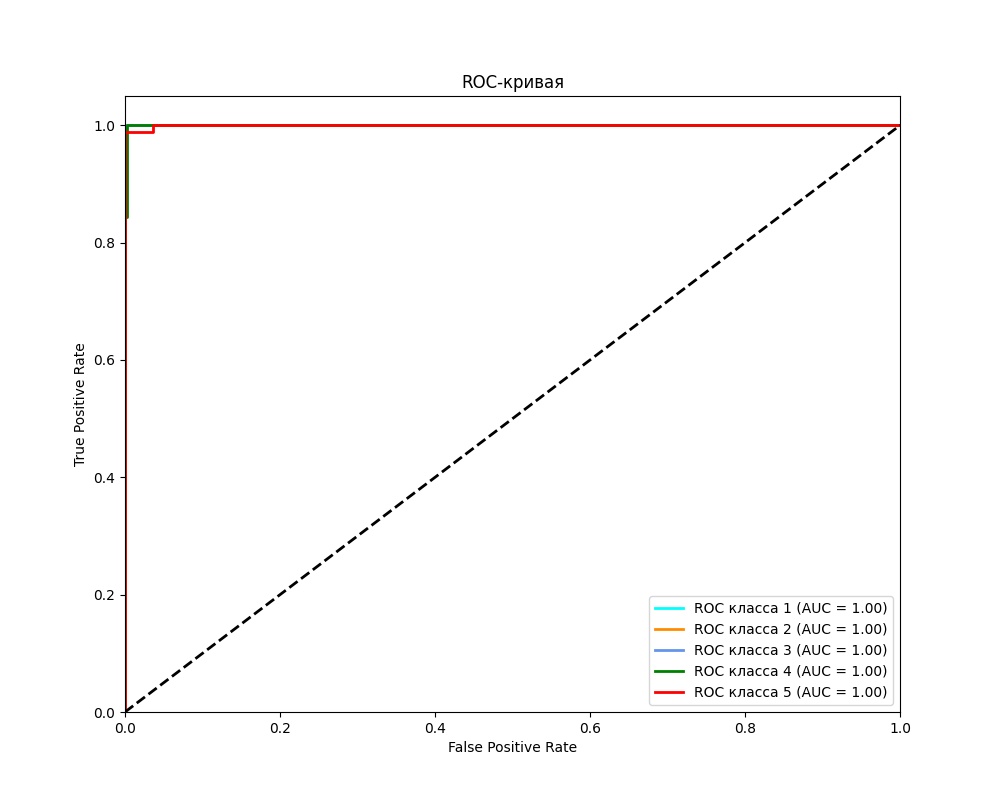

# Отчет 2.
## 1. Матрица неточностей

### Приложение

Возможная причина ошибки: наличие ушной серы, расфокус камеры

## 2. Отчет классификации Sklearn
```
              precision    recall  f1-score   support

           1       1.00      1.00      1.00        90
           2       1.00      1.00      1.00        90
           3       1.00      1.00      1.00        90
           4       0.98      1.00      0.99        90
           5       1.00      0.98      0.99        90

    accuracy                           1.00       450
   macro avg       1.00      1.00      1.00       450
weighted avg       1.00      1.00      1.00       450
```
## 3. ROC кривые
